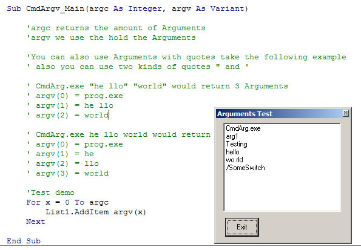



## Command Line Argv

### Description

Hi,

This is some code I made about 30 min ago that will phase in the commandline Arguments. A little like what you see in C++, supports command line Arguments with spaces, quotes, find out the number of Arguments. I also included a small example

Hope you may find it usfll.
 
### More Info
 

             |
---                |---
**Submitted On**   |2000-10-20 05:46:14
**By**             |[dreamvb](https://github.com/Planet-Source-Code/PSCIndex/blob/master/ByAuthor/dreamvb.md)
**Level**          |Beginner
**User Rating**    |4.3 (13 globes from 3 users)
**Compatibility**  |VB 5\.0, VB 6\.0
**Category**       |[Files/ File Controls/ Input/ Output](https://github.com/Planet-Source-Code/PSCIndex/blob/master/ByCategory/files-file-controls-input-output__1-3.md)
**World**          |[Visual Basic](https://github.com/Planet-Source-Code/PSCIndex/blob/master/ByWorld/visual-basic.md)
**Archive File**   |[Command\_Li19419410202005\.zip](https://github.com/Planet-Source-Code/dreamvb-command-line-argv__1-62961/archive/master.zip)

